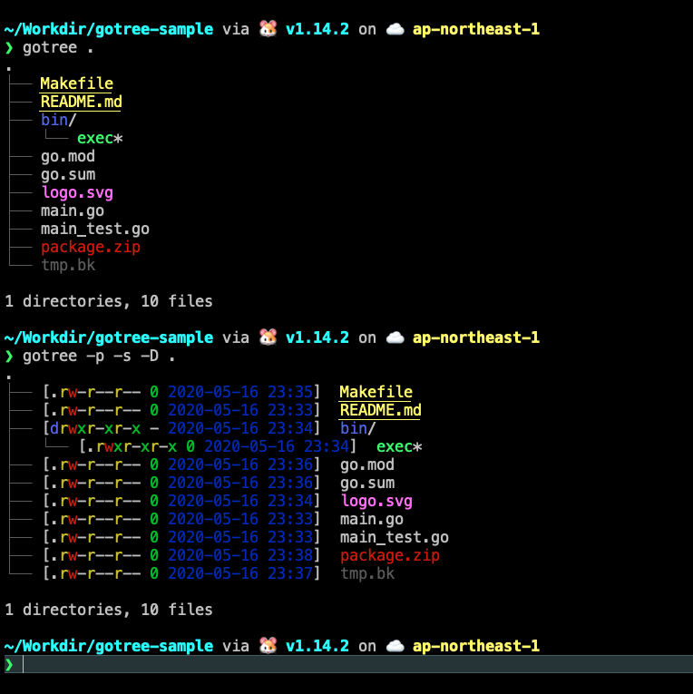

# Gotree

gotree is a replacement for tree command written in Go. It was inspired by [exa](https://github.com/ogham/exa).

# Screenshots



# Download

## Linux
```
VERSION=v0.6.2
curl -L "https://github.com/Raita876/gotree/releases/download/${VERSION}/release-lin64.zip" -o ./release-lin64.zip
unzip ./release-lin64.zip
chmod +rx ./gotree
mv ./gotree /usr/local/bin/
```

## Mac OS
```
VERSION=v0.6.2
curl -L "https://github.com/Raita876/gotree/releases/download/${VERSION}/release-mac64.zip" -o ./release-mac64.zip
unzip ./release-mac64.zip
chmod +rx ./gotree
mv ./gotree /usr/local/bin/
```
